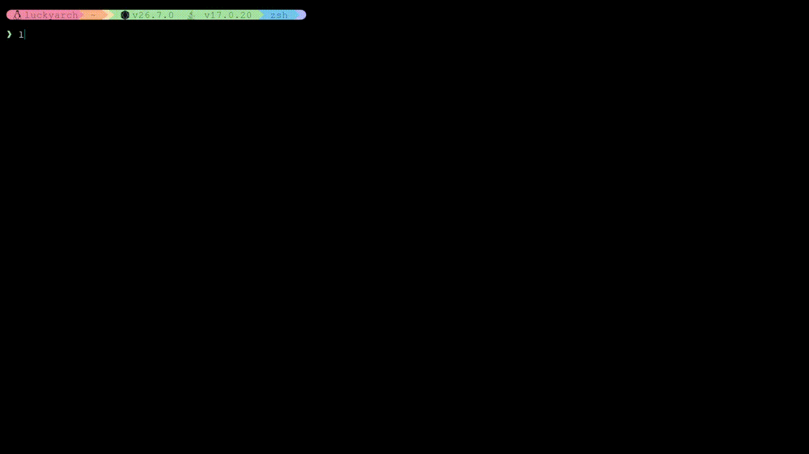
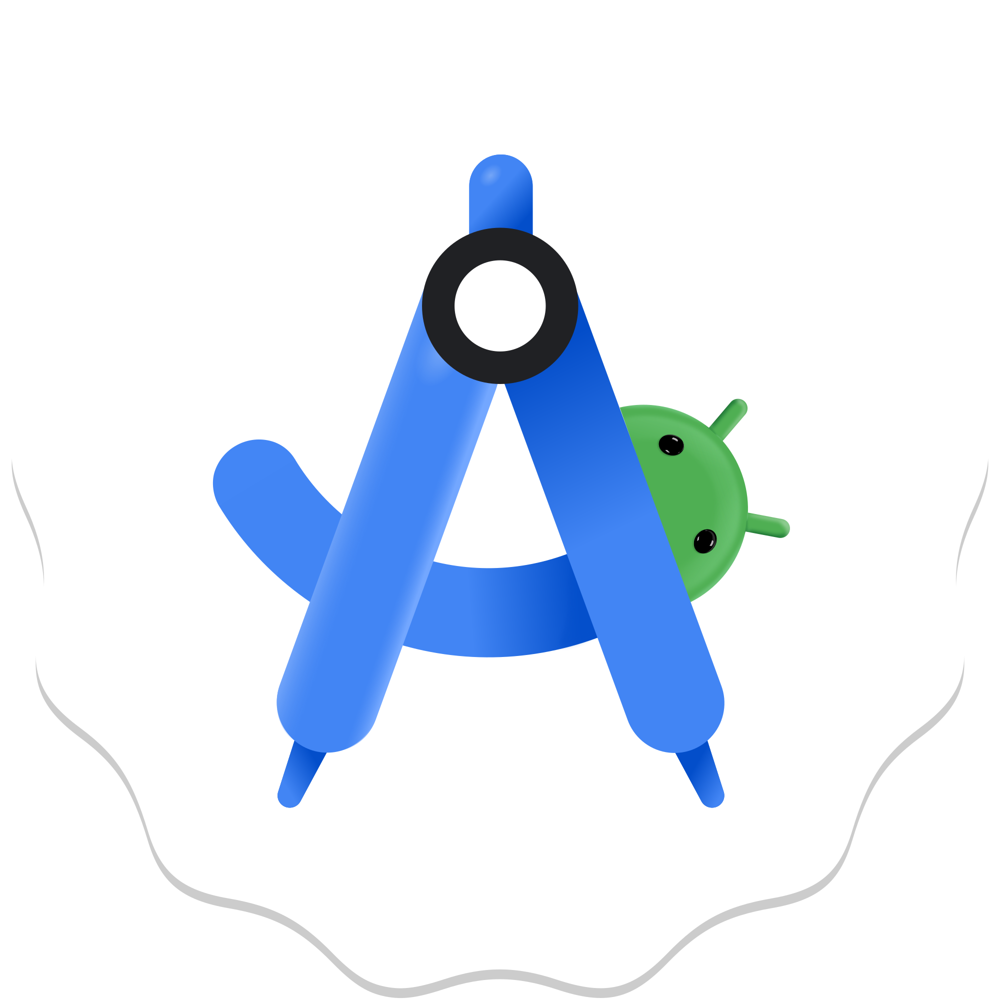
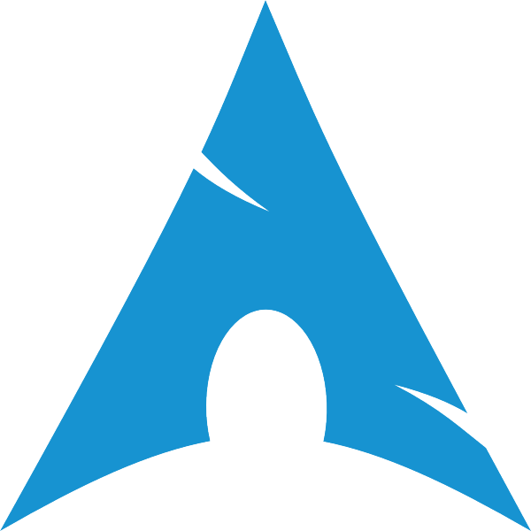
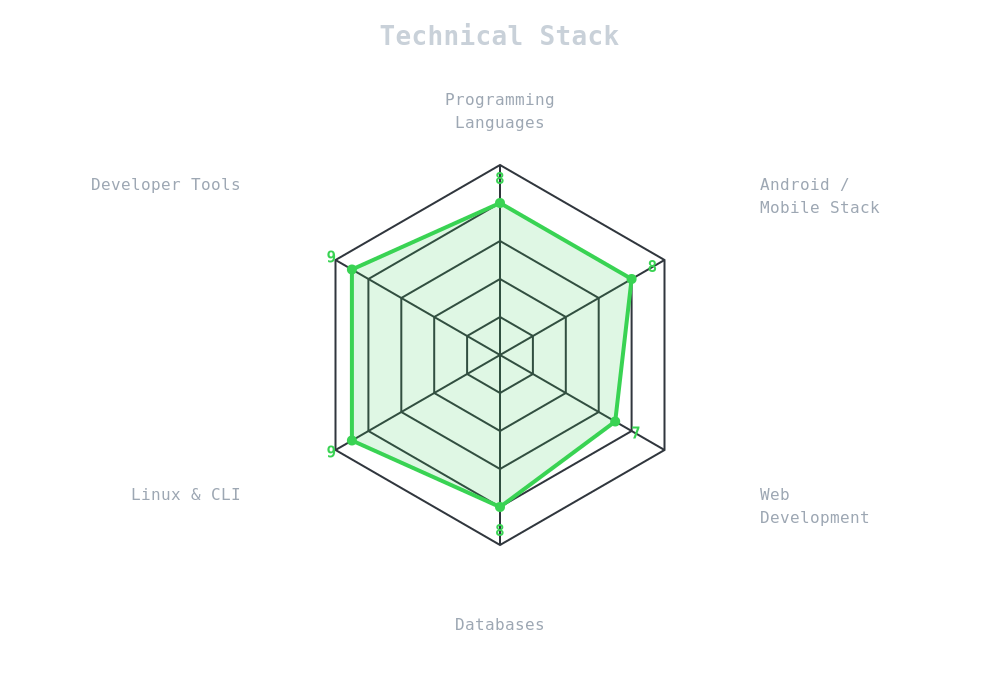
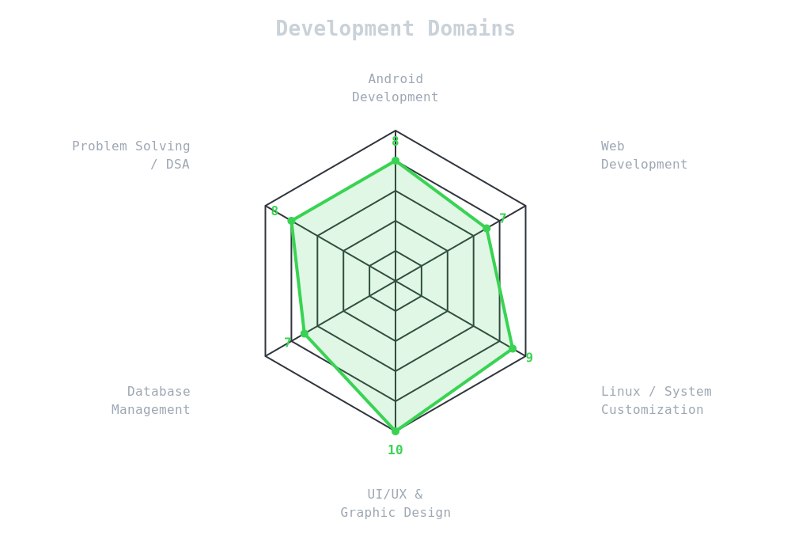

 

 

<a href="https://leetcode.com/u/Im_1ucky/">
  

 

## `~/` toolbox

### Languages

<table>
<tr>
<td align="center">
 
C/C++
</td>

<td align="center">
 
Python
</td>

<td align="center">
 
Kotlin
</td>

<td align="center">
 
JavaScript
</td>

<td align="center">
 
Dart
</td>

<td align="center">
 
Java
</td>
</tr>
</table>

### Frameworks

<table>
<tr>
<td align="center">
 
Flutter
</td>

<td align="center">
 
React
</td>

<td align="center">
 
Compose
</td>
</tr>
</table>

### Databases

<table>
<tr>
<td align="center">
 
MySQL
</td>

<td align="center">
 
PostgreSQL
</td>

<td align="center">
 
SQLite
</td>
</tr>
</table>

### Tools

<table>
<tr>
<td align="center">
 
Linux
</td>

<td align="center">
 
Arch Linux
</td>

<td align="center">
 
Git
</td>

<td align="center">
 
Neovim
</td>

<td align="center">
 
Bash
</td>

<td align="center">
 
Blender
</td>
</tr>
</table>

---

## `~/` skill radar

<table>
<tr>
<td align="center" width="50%">

</td>
<td align="center" width="50%">

</td>
</tr>
</table>

---

## `~/` contribution calendar

## `~/` the numbers

